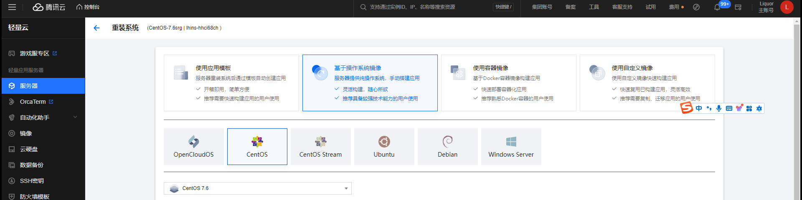

Tarzan 一个复制-粘贴-敲回车K8s环境就好了

# 前置准备

**确定服务器系统镜像&OS内核版本**

- 新机器直接安装Centos7镜像


- 老机器可以进入shell查看是否符合

```bash
[root@k8s-master tarzan]# cat /proc/version # 也可以使用命令uname -r查看 3.10.0-1160.119.1.el7.x86_64
Linux version 3.10.0-1160.119.1.el7.x86_64 (mockbuild@kbuilder.bsys.centos.org) (gcc version 4.8.5 20150623 (Red Hat 4.8.5-44) (GCC) )
[root@k8s-master tarzan]# uname -m
x86_64
[root@k8s-master tarzan]# cat /etc/redhat-release
CentOS Linux release 7.9.209 (Core)
```

**机器归属说明**

| System                               | Roles      | Internal IP Address | External IP Address | Port |
| ------------------------------------ | ---------- | ------------------- | ------------------- | ---- |
| CentOS Linux release 7.9.209 (Core) | k8s-master |      10.0.0.3       |     115.233.233.15  | 22   |
| CentOS Linux release 7.9.209 (Core) | k8s-node1  |      10.0.0.8       |     115.233.233.16  | 22   |
| CentOS Linux release 7.9.209 (Core) | k8s-node2  |      10.0.0.9       |     115.233.233.17  | 22   |
| CentOS Linux release 7.9.209 (Core) | k8s-node3  |      10.0.0.10      |     115.233.233.18  | 2222 |

**k8s-master机器上做操作**

```bash
# 内网、外网所需变量是不一样的
# 将包download后 cd到项目根目录（以下所有操作必须要到项目根目录）
# 配置hosts （实际以有多少台机器就填加相对应的）
[root@k8s-master tarzan]# bash -c 'cat << EOF >> conf/hosts
10.0.0.3 k8s-master
10.0.0.8 k8s-node1
10.0.0.9 k8s-node2
10.0.0.10 k8s-node3
EOF'

# 检查本地是否安装sshpass
[root@k8s-master tarzan]# which sshpass
/usr/bin/sshpass # 看到这里即OK
# 如果没有可以采用我提供的离线包（tarzan-offline*这种类型的采用）tarzan-online的只需执行 yum install -y sshpass
[root@k8s-master tarzan]# rpm -ivhU offline/base-dependence/sshpass-1.06-2.el7.x86_64.rpm --nodeps --force
Preparing...                          ################################# [100%]
Updating / installing...
   1:sshpass-1.06-2.el7               ################################# [100%]
   
# 配置ssh-copy（需要用到setup-ssh-keys.sh脚本）,具体格式如下：
# user@hostname 在执行时需要跟随 ./setup-ssh-keys.sh generate_ssh_key ${port} ${password}
# user@hostname:password 在执行时需要跟随 ./setup-ssh-keys.sh generate_ssh_key ${port}
# user@hostname:password:port 只需执行./setup-ssh-keys.sh generate_ssh_key
bash -c 'cat << EOF >> conf/ssh_hosts
root:10.0.0.3:1235678
root:10.0.0.8:2235678:22
root:10.0.0.9:3235678:22
root:10.0.0.10:3235678:2222  # 注意使用非标准端口
EOF'

# 配置免密钥登陆,一直回车
[root@k8s-master tarzan]# chmod +x setup-ssh-keys.sh && ./setup-ssh-keys.sh generate_ssh_key（操作几次都没有关系）
[root@k8s-master tarzan]# ./setup-ssh-keys.sh setup_ssh_for_targets
## [Tarzan Log]: 2024-09-27 11:23:00 - 生成新的 SSH 密钥对...  
## [Tarzan Log]: 2024-09-27 11:23:00 - Executing command: ssh-keygen -t rsa -b 4096 -N '' -f ~/.ssh/id_rsa  
Generating public/private rsa key pair.
Created directory '/root/.ssh'.
Your identification has been saved in /root/.ssh/id_rsa.
Your public key has been saved in /root/.ssh/id_rsa.pub.
The key fingerprint is:
SHA256:kPb51PtSnlmWhLAXrVDrARHvY81z53ihgb7dV7Ek8G4 root@k8s-master
The key's randomart image is:
+---[RSA 4096]----+
|           ++..  |
|       .   +o... |
|      +     *++  |
|     . o . o+*++ |
|        S ..+*+=*|
|         o. .E==O|
|          ..o+.=+|
|            +.=..|
|           . o...|
+----[SHA256]-----+
## [Tarzan Log]: 2024-09-27 11:23:00 - SSH 密钥对生成成功。  
## [Tarzan Log]: 2024-09-27 11:23:00 - 正在将公钥复制到 root@10.0.0.3 ...  
/usr/bin/ssh-copy-id: INFO: Source of key(s) to be installed: "/root/.ssh/id_rsa.pub"
/usr/bin/ssh-copy-id: INFO: attempting to log in with the new key(s), to filter out any that are already installed
/usr/bin/ssh-copy-id: INFO: 1 key(s) remain to be installed -- if you are prompted now it is to install the new keys
Permission denied, please try again.
## [Tarzan Log]: 2024-09-27 11:23:00 - 复制公钥到 root@10.0.0.3 失败，请检查连接和凭据。  
## [Tarzan Log]: 2024-09-27 11:23:00 - 正在检查 root@10.0.0.3 ...  
## [Tarzan Log]: 2024-09-27 11:23:00 - 网络连接正常。  
## [Tarzan Log]: 2024-09-27 11:23:00 - SSH 服务已安装并正常运行。  
.....
```

# 离线安装

```bash
# 基于tarzan-offline-multiple包
# Master 10.0.0.3
[root@k8s-master tarzan]# sh install-kube.sh -v v1.23.3 -addr 10.0.0.3 --flannel --hostname k8s-master # (内网)
# 安装完Master之后会得到一个join指令（Kubeadm join command）
[root@k8s-master tarzan]# kubeadm join 10.0.0.3:6443 --token 0dy3rl.33bugu3rax35r815 --discovery-token-ca-cert-hash sha256:0c7e8afb55c242c351bfb744cc4e64cf7221033f3dd7f4aaa995602cb6af3b9d
# 假设k8s-master对应的外网为115.132.233.15 则需追加参数 -addr 115.132.233.15 --create-virtualeth
[root@k8s-master tarzan]# sh install-kube.sh -v v1.23.3 -addr 115.132.233.15 --create-virtualeth --flannel --hostname k8s-master
# Slave
[root@k8s-master tarzan]# ./setup-ssh-keys.sh copy_file_to_machines kube_slave.tar.gz # 还是Master做操作
[root@k8s-node1 tarzan]# sh install-kube.sh --hostname k8s-node1 && ${Kubeadm join command} # k8s-node1
[root@k8s-node2 tarzan]# sh install-kube.sh --hostname k8s-node2 && ${Kubeadm join command} # k8s-node2
[root@k8s-node3 tarzan]# sh install-kube.sh --hostname k8s-node3 && ${Kubeadm join command} # k8s-node3
# 如果是外网则需在加入前执行
[root@k8s-node1 tarzan]# sh common.sh add_virtual_ip ${external-node-ip} ${interface}
# 或者在安装时增加  -addr ${node-addr-ip} --create-virtualeth  即
[root@k8s-node1 tarzan]# sh install-kube.sh --hostname k8s-node1 -addr 114.132.233.16 --create-virtualeth  && ${Kubeadm join command} # k8s-node1
[root@k8s-node1 tarzan]# kubectl get nodes
The connection to the server localhost:8080 was refused - did you specify the right host or port?
# 从master上复制sz $HOME/.kube/config到Node机器上即可
[root@k8s-master tarzan-online]# kubectl get node -o wide
NAME         STATUS   ROLES                  AGE   VERSION   INTERNAL-IP       EXTERNAL-IP   OS-IMAGE                KERNEL-VERSION                 CONTAINER-RUNTIME
k8s-master   Ready    control-plane,master   16h   v1.23.3   10.0.0.3          <none>        CentOS Linux 7 (Core)   3.10.0-1160.119.1.el7.x86_64   containerd://1.6.26
k8s-node1    Ready    <none>                 10m   v1.23.3   114.132.233.16    <none>        CentOS Linux 7 (Core)   3.10.0-1160.119.1.el7.x86_64   containerd://1.6.26
k8s-node2    Ready    <none>                 10m   v1.23.3   10.0.0.9          <none>        CentOS Linux 7 (Core)   3.10.0-1160.119.1.el7.x86_64   containerd://1.6.26
k8s-node3    Ready    <none>                 10m   v1.23.3   10.0.0.10         <none>        CentOS Linux 7 (Core)   3.10.0-1160.119.1.el7.x86_64   containerd://1.6.26
```

# 在线安装

```bash
# 基于tarzan-online包
# 携带参数如下
--image-pull-policy Always
```

# 测试应用

```bash
[root@VM-0-3-centos tarzan]# sh install-addons.sh metrics 0.6.4 2.10.0
## [Tarzan Log]: 2024-09-27 11:27:00  - 准备安装 metrics 版本 0.6.4 和 state-metrics-standard 版本 2.10.0  
## [Tarzan Log]: 2024-09-27 11:27:00  - 开始安装组件 metrics-v0.6.4  
## [Tarzan Log]: 2024-09-27 11:27:00  - Executing command: kubectl apply -f addons/kube-metrics/0.6.4/metrics-init.yaml  
serviceaccount/metrics-server created
clusterrole.rbac.authorization.k8s.io/system:aggregated-metrics-reader created
clusterrole.rbac.authorization.k8s.io/system:metrics-server created
rolebinding.rbac.authorization.k8s.io/metrics-server-auth-reader created
clusterrolebinding.rbac.authorization.k8s.io/metrics-server:system:auth-delegator created
clusterrolebinding.rbac.authorization.k8s.io/system:metrics-server created
service/metrics-server created
deployment.apps/metrics-server created
apiservice.apiregistration.k8s.io/v1beta1.metrics.k8s.io created
No resources found in metrics namespace.
No resources found in metrics namespace.
## [Tarzan Log]: 2024-09-27 11:27:00  - metrics安装完成  
## [Tarzan Log]: 2024-09-27 11:27:00  - 开始安装组件 kube-state-metrics-v2.10.0  
## [Tarzan Log]: 2024-09-27 11:27:00  - Executing command: kubectl apply -f addons/kube-state-metrics-standard/2.10.0  
clusterrolebinding.rbac.authorization.k8s.io/kube-state-metrics created
clusterrole.rbac.authorization.k8s.io/kube-state-metrics created
deployment.apps/kube-state-metrics created
serviceaccount/kube-state-metrics created
service/kube-state-metrics created
No resources found in kube-state-metrics namespace.
No resources found in kube-state-metrics namespace.
## [Tarzan Log]: 2024-09-27 11:27:00  - kube-state-metrics安装完成 

# 修改NodePort的默认端口 原理：默认k8s的使用端口的范围为30000左右，作为对外部提供的端口。我们也可以通过对配置文件的修改去指定默认的对外端口的范围。
[root@k8s-master tarzan]# vim /etc/kubernetes/manifests/kube-apiserver.yaml
spec:
  containers:
  - command:
    - kube-apiserver
    - --service-node-port-range=1-65535 # 添加
# 部署一个简单的nginx应用
[root@VM-0-3-centos tarzan-online]# kubectl apply -f addons/kube-ingress-nginx/example/nginx-deployment-nodeport.yaml
namespace/kube-example unchanged
deployment.apps/ndp-nginx created
service/ndp-nginx-svc created
Warning: autoscaling/v2beta1 HorizontalPodAutoscaler is deprecated in v1.22+, unavailable in v1.25+; use autoscaling/v2 HorizontalPodAutoscaler
horizontalpodautoscaler.autoscaling/ndp-nginx-hpa-c created
horizontalpodautoscaler.autoscaling/ndp-nginx-hpa-m created
[root@VM-0-3-centos tarzan-online]# kubectl get all -n kube-example
NAME                             READY   STATUS    RESTARTS   AGE
pod/ndp-nginx-86dd798bf9-wfx68   1/1     Running   0          19s

NAME                    TYPE       CLUSTER-IP     EXTERNAL-IP   PORT(S)        AGE
service/ndp-nginx-svc   NodePort   10.105.43.26   <none>        80:30001/TCP   18s

NAME                        READY   UP-TO-DATE   AVAILABLE   AGE
deployment.apps/ndp-nginx   1/1     1            1           19s

NAME                                   DESIRED   CURRENT   READY   AGE
replicaset.apps/ndp-nginx-86dd798bf9   1         1         1       19s

NAME                                                  REFERENCE              TARGETS         MINPODS   MAXPODS   REPLICAS   AGE
horizontalpodautoscaler.autoscaling/ndp-nginx-hpa-c   Deployment/ndp-nginx   <unknown>/80%   1         2         1          18s
horizontalpodautoscaler.autoscaling/ndp-nginx-hpa-m   Deployment/ndp-nginx   <unknown>/80%   1         2         1          18s

# horizontalpodautoscaler TARGETS 有一个unknown?等待1min后再次刷新OK，开放30001端口后即可访问了
```

# 二次开发

**拉取代码**

```bash
# 因为包有点大所以需要克隆深度=1，其中很多离线包 所以需要用到git-lfs插件
[root@k8s-master opt]# git clone --depth=1 git@github.com:kamalyes/tarzan.git
[root@k8s-master opt]# cd tarzan
```

**脚本列表**

- `common.sh`: 通用函数库
- `crictl.sh`: 容器运行时管理
- `gitattributes.sh`: Git 属性管理
- `install-addons.sh`: 安装 Kubernetes 附加组件
- `install-kube.sh`: 安装 Kubernetes
- `setupconfig.sh`: 配置设置
- `setup-ssh-keys.sh`: SSH 密钥设置
- `update-kubeadm-cert.sh`: 更新 kubeadm 证书
- `update_changelog.sh`: 更新变更日志
- `variables.sh`: 变量定义
- `yum-packages.sh`: 使用 yum 安装包

**指令说明**

```bash
[root@k8s-master tarzan]# chmod +x install-kube.sh
[root@k8s-master tarzan]# ./install-kube.sh -h
Usage: ./install-kube.sh [options]
Options:
   -v, --version                               Versions 1.23.3, 1.28.2 are currently supported, default=1.23.3
   -p, --port                                  Port number for external access, default=6443
   -addr, --advertise_address                  kubectl access address, default=127.0.0.1
   -tk, --token                                token, default=tarzan.e6fa0b76a6898af7
   -hname, --hostname [hostname]               set hostname, default=k8s-master
   --flannel                                   use flannel network, and set this node as master
   --calico                                    use calico network, and set this node as master
   --slavepath                                 slave packaged path, default=kube_slave
   --image-repository                          default=registry.cn-hangzhou.aliyuncs.com/google_containers
   --addons-image-repository                   default=registry.cn-shenzhen.aliyuncs.com/isimetra
   --image-pull-policy                         imagePullPolicy (Always, IfNotPresent, Never) are currently supported, default=IfNotPresent
   --containerd-timeout                        default=4h0m0s
   --pod-subnet                                default=172.22.0.0/16
   --serviceSubnet                             default=10.96.0.0/12
   --join                                      join the Kubernetes cluster
   --masterip                                  master node IP address
   --discovery-token-ca-cert-hash              discovery token CA cert hash
   -create-vreth|--create-virtualeth           default=false
   -h, --help                                  find help
   Master: sh install-kube.sh -v v1.23.3 -addr 10.0.8.3 --flannel
   Slave:  sh install-kube.sh 
   Slave Join:  sh install-kube.sh --join --masterip xxxx --token xxx --discovery-token-ca-cert-hash xxxx
```
