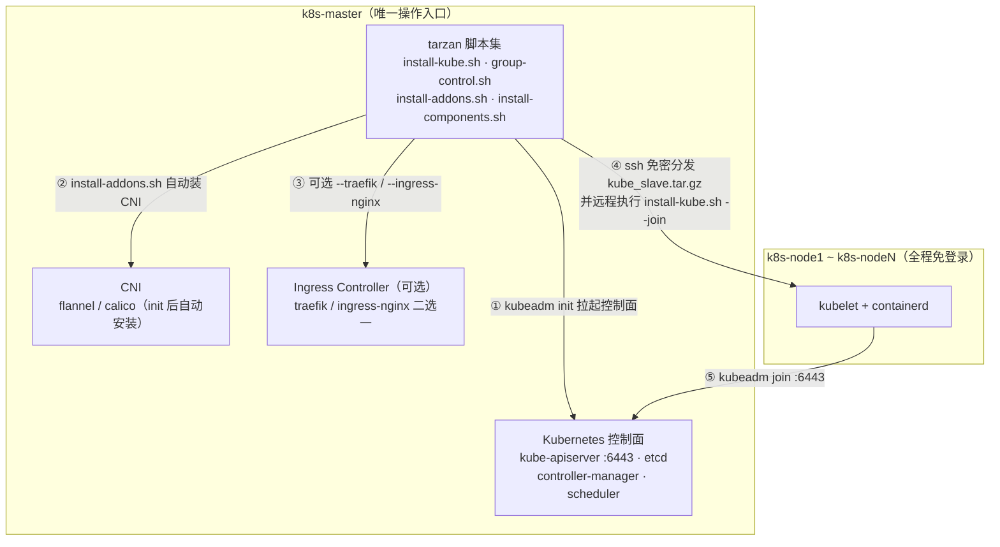
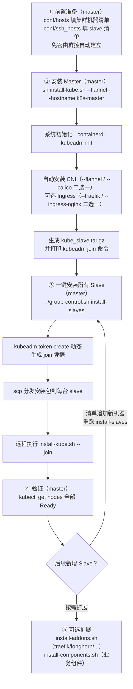

Tarzan 一个复制-粘贴-敲回车 K8s 集群环境就好了

> **全程只需在 k8s-master 一台机器上操作**：一条命令装好 Master（含系统初始化、containerd、kubeadm init、CNI），一条命令让所有 Slave 自动加入集群，后续新增节点同样是一条命令，无需登录任何一台 Slave

# 架构与流程

## 整体架构


```mermaid
graph TB
    subgraph MASTER["k8s-master（唯一操作入口）"]
        direction TB
        SCRIPTS["tarzan 脚本集<br/>install-kube.sh · group-control.sh<br/>install-addons.sh · install-components.sh"]
        CP["Kubernetes 控制面<br/>kube-apiserver :6443 · etcd<br/>controller-manager · scheduler"]
        CNI["CNI<br/>flannel / calico（init 后自动安装）"]
        ING["Ingress Controller（可选）<br/>traefik / ingress-nginx 二选一"]
    end

    subgraph SLAVES["k8s-node1 ~ k8s-nodeN（全程免登录）"]
        NODE["kubelet + containerd"]
    end

    SCRIPTS -- "① kubeadm init 拉起控制面" --> CP
    SCRIPTS -- "② install-addons.sh 自动装 CNI" --> CNI
    SCRIPTS -- "③ 可选 --traefik / --ingress-nginx" --> ING
    SCRIPTS -- "④ ssh 免密分发 kube_slave.tar.gz<br/>并远程执行 install-kube.sh --join" --> NODE
    NODE -- "⑤ kubeadm join :6443" --> CP
```

## 安装流程


```mermaid
flowchart TD
    A["① 前置准备（master）<br/>conf/hosts 填集群机器清单<br/>conf/ssh_hosts 填 slave 清单<br/>免密由群控自动建立"] --> B["② 安装 Master（master）<br/>sh install-kube.sh --flannel --hostname k8s-master"]
    B --> B1["系统初始化 · containerd · kubeadm init"]
    B1 --> B2["自动安装 CNI（--flannel / --calico 二选一）<br/>可选 Ingress（--traefik / --ingress-nginx 二选一）"]
    B2 --> B3["生成 kube_slave.tar.gz<br/>并打印 kubeadm join 命令"]
    B3 --> C["③ 一键安装所有 Slave（master）<br/>./group-control.sh install-slaves"]
    C --> C1["kubeadm token create 动态生成 join 凭据"]
    C1 --> C2["scp 分发安装包到每台 slave"]
    C2 --> C3["远程执行 install-kube.sh --join"]
    C3 --> D["④ 验证（master）<br/>kubectl get nodes 全部 Ready"]
    D --> E{"后续新增 Slave？"}
    E -- "清单追加新机器<br/>重跑 install-slaves" --> C
    E -- "按需扩展" --> F["⑤ 可选扩展<br/>install-addons.sh（traefik/longhorn/...）<br/>install-components.sh（业务组件）"]
```

# 前置准备

**支持矩阵**

| 操作系统            | 安装方式   | 说明                                                    |
| ------------------- | ---------- | ------------------------------------------------------- |
| CentOS 7.x          | 离线 + 在线 | 完整支持（离线包按 el7 RPM 组织）                        |
| CentOS 8.x          | 仅在线     | 系统已 EOL，依赖自动切换阿里云 vault 归档源              |
| Debian 10 / 11 / 12 | 仅在线     | apt 在线安装依赖                                         |

> 混部说明：master 为 CentOS 7（离线）+ slave 为 CentOS 8 / Debian 可行，slave 加入时由本机在线安装依赖，不消费 master 分发包中的 RPM；同系集群（全 CentOS 7）仍推荐纯离线。

**云厂商支持**

| 云厂商       | 探测方式                     | 软件源策略                                        |
| ------------ | ---------------------------- | ------------------------------------------------- |
| 阿里云 ECS   | metadata 100.100.100.200     | 内网镜像 `mirrors.cloud.aliyuncs.com`（免公网流量） |
| 腾讯云 CVM   | metadata.tencentyun.com      | 内网镜像 `mirrors.cloud.tencent.com`（免公网流量） |
| AWS EC2      | IMDS 169.254.169.123（v1/v2）| 官方源 `vault.centos.org` / `pkgs.k8s.io` / `download.docker.com` |
| 裸机 / 其他  | -                            | 默认公网镜像 `mirrors.aliyun.com`                  |

> - 云上部署需在控制台**安全组放行**：6443（API Server）、2379/2380（etcd）、10250-10252（kubelet/scheduler/controller）、8472/UDP（flannel VXLAN）、30000-32767（NodePort）
> - AWS 上建议安装命令携带 `--image-repository registry.k8s.io`（默认的阿里云容器镜像仓库海外拉取较慢）

**确定服务器系统镜像&OS内核版本**

```bash
[root@k8s-master tarzan]# cat /proc/version # 也可以使用命令uname -r查看 3.10.0-1160.119.1.el7.x86_64
Linux version 3.10.0-1160.119.1.el7.x86_64 (mockbuild@kbuilder.bsys.centos.org) (gcc version 4.8.5 20150623 (Red Hat 4.8.5-44) (GCC) )
[root@k8s-master tarzan]# uname -m
x86_64
[root@k8s-master tarzan]# cat /etc/redhat-release
CentOS Linux release 7.9.209 (Core)
```

**机器归属说明**

| System                               | Roles      | Internal IP Address | External IP Address | Port |
| ------------------------------------ | ---------- | ------------------- | ------------------- | ---- |
| CentOS Linux release 7.9.209 (Core) | k8s-master |      10.0.0.3       |     115.233.233.15  | 22   |
| CentOS Linux release 7.9.209 (Core) | k8s-node1  |      10.0.0.8       |     115.233.233.16  | 22   |
| CentOS Linux release 7.9.209 (Core) | k8s-node2  |      10.0.0.9       |     115.233.233.17  | 22   |
| CentOS Linux release 7.9.209 (Core) | k8s-node3  |      10.0.0.10      |     115.233.233.18  | 2222 |

**获取安装包**

```bash
# 全部历史包见 Release 页面: https://github.com/kamalyes/tarzan/releases
# 包名格式: tarzan-<tag>-<commit>-<包型>.tar.gz, 四种包型:
#   centos7-offline-multiple  CentOS 7 全量离线(双版本 k8s 离线包)
#   centos7-offline-1.23.3   CentOS 7 单版本离线(仅 1.23.3)
#   centos7-offline-1.28.2   CentOS 7 单版本离线(仅 1.28.2)
#   online                    通用在线包(CentOS 7/8、Debian 通用, 安装时自动识别本机系统)
# 以下 tag/commit 为示例, 以 Release 页面实际文件名为准
# 国内服务器直连 GitHub 慢, 可在下载链接前加代理前缀加速(任选其一, 失效就换一个或直连):
#   wget -c -t 0 --timeout=30 https://gh-proxy.com/https://github.com/kamalyes/tarzan/releases/download/<tag>/<包名>.tar.gz
#   可用前缀: https://gh-proxy.com/ | https://ghproxy.net/ | https://ghfast.top/
#   -c 断点续传 + -t 0 断开自动重试, 防止大包下载中断导致 tar 解压报 unexpected EOF
#   解压前可先校验完整性: gzip -t <包名>.tar.gz (无输出即完整)
# CentOS 7 集群推荐离线包:
[root@k8s-master opt]# wget -c -t 0 --timeout=30 https://github.com/kamalyes/tarzan/releases/download/v0.0.2/tarzan-v0.0.2-f42a3c8-centos7-offline-1.23.3.tar.gz
[root@k8s-master opt]# tar -xzf tarzan-v0.0.2-f42a3c8-centos7-offline-1.23.3.tar.gz
[root@k8s-master opt]# cd tarzan-centos7-offline-1.23.3
# CentOS 8 / Debian 集群使用通用在线包(解压后脚本自动识别本机系统分派):
[root@k8s-master opt]# wget -c -t 0 --timeout=30 https://github.com/kamalyes/tarzan/releases/download/v0.0.2/tarzan-v0.0.2-f42a3c8-online.tar.gz
[root@k8s-master opt]# tar -xzf tarzan-v0.0.2-f42a3c8-online.tar.gz
[root@k8s-master opt]# cd tarzan-online
```

**以下操作全部在 k8s-master 上进行**

```bash
# 所有操作必须在项目根目录(上一步解压出的目录)下执行

# 1. 配置集群机器清单 conf/hosts（有几台填几台, master + 所有 slave）
[root@k8s-master tarzan]# bash -c 'cat << EOF >> conf/hosts
10.0.0.3 k8s-master
10.0.0.8 k8s-node1
10.0.0.9 k8s-node2
10.0.0.10 k8s-node3
EOF'
# 安装时脚本会把 conf/hosts 同步到所有机器的 /etc/hosts

# 2. 配置受管机器清单 conf/ssh_hosts, 格式 user:host:password[:port] 每行一台
#    行首 # 或行内 # 之后的内容都会被忽略（新增/剔除节点就靠注释）
[root@k8s-master tarzan]# bash -c 'cat << EOF >> conf/ssh_hosts
root:10.0.0.8:2235678:22
root:10.0.0.9:3235678:22
root:10.0.0.10:3235678:2222  # 注意使用非标准端口
EOF'

# 3. 免密无需手动建立: 群控命令(exec/copy/install-slaves)首次执行时自动生成本机密钥
#    并对未免密的机器分发公钥, conf/ssh_hosts 里的密码仅用于这一次分发, 之后全走密钥免密
#    (首次分发依赖 sshpass: CentOS 7 离线包已自带 rpm, 在线环境 yum install -y sshpass)
```

# 安装 Master

```bash
# 注意: 下面 5 条命令是不同场景的完整示例, 按你的场景任选一条执行即可, 不要每条都跑
# -y 全程免交互: 自动确认脚本内所有询问(依赖/组件覆盖安装等), 群控远程 join 也会自动携带
# 最小命令: CNI(--flannel/--calico 二选一) + 主机名, 其余参数都有默认值(版本 1.23.3 等)
[root@k8s-master tarzan]# sh install-kube.sh -y --flannel --hostname k8s-master

# 指定版本与地址(内网)
[root@k8s-master tarzan]# sh install-kube.sh -y -v v1.23.3 -addr 10.0.0.3 --flannel --hostname k8s-master

# 外网场景(假设 master 外网为 115.233.233.15): 追加 -addr 外网IP --create-virtualeth 创建虚拟网卡
[root@k8s-master tarzan]# sh install-kube.sh -y -v v1.23.3 -addr 115.233.233.15 --create-virtualeth --flannel --hostname k8s-master

# Ingress Controller 可跟随 Master 初始化一起安装(与 CNI 组合使用, traefik/ingress-nginx 互斥二选一)
[root@k8s-master tarzan]# sh install-kube.sh -y --flannel --traefik --hostname k8s-master
[root@k8s-master tarzan]# sh install-kube.sh -y --calico --ingress-nginx --hostname k8s-master
```

安装自动完成：系统初始化（内核参数/模块/chrony）→ containerd → `kubeadm init` → **自动安装所选 CNI** →（可选）安装 Ingress → 打包 `kube_slave.tar.gz` 并打印 join 命令：

```bash
## [Tarzan Log]: 2024-09-27 11:25:12 - Executing command: kubeadm token create --print-join-command --ttl=0
kubeadm join 10.0.0.3:6443 --token 0dy3rl.33bugu3rax35r815 --discovery-token-ca-cert-hash sha256:0c7e8afb55c242c351bfb744cc4e64cf7221033f3dd7f4aaa995602cb6af3b9d
```

> 该 join 命令供"手工方式"加入 slave 使用；**推荐直接走下面的群控一键安装，凭据由脚本动态生成，无需复制粘贴**

# 安装 Slave

## 方式一: 群控一键安装（推荐， 全程在 master 操作）

```bash
[root@k8s-master tarzan]# ./group-control.sh install-slaves
```

脚本自动完成：免密自举（首次执行自动生成密钥并分发公钥，之后不再使用密码）→ 动态生成 join 凭据（`kubeadm token create`，不复用旧 token）→ 逐台分发 `kube_slave.tar.gz` → 远程解压并执行 `install-kube.sh --join`

注意：`install-slaves` 会**自动跳过**清单里的 master 与已加入集群的节点（按 `/etc/kubernetes/kubelet.conf` 判断），清单无需注释已装机器；某台安装失败会明确报错且不影响其余机器继续安装，全部装完后整体退出码非 0

## 方式二: 手工方式

```bash
# 1. master 上分发安装包
[root@k8s-master tarzan]# ./setup-ssh-keys.sh copy_file_to_machines kube_slave.tar.gz

# 2. 登录每台 slave 解压执行（内网）
[root@k8s-node1 tarzan]# sh install-kube.sh -y --join --masterip 10.0.0.3:6443 --token 0dy3rl.33bugu3rax35r815 --discovery-token-ca-cert-hash sha256:0c7e8afb55c242c351bfb744cc4e64cf7221033f3dd7f4aaa995602cb6af3b9d

# 3. 外网 slave 需在安装时追加 -addr ${node-external-ip} --create-virtualeth
[root@k8s-node1 tarzan]# sh install-kube.sh -y --join -addr 114.132.233.16 --create-virtualeth --masterip 115.233.233.15:6443 --token xxx --discovery-token-ca-cert-hash xxxx
```

slave 安装包自带 admin config 并自动配置 KUBECONFIG，加入后直接可在 node 上使用 kubectl：

```bash
[root@k8s-node1 tarzan]# kubectl get nodes
```

## 集群验证

```bash
[root@k8s-master tarzan]# kubectl get node -o wide
NAME         STATUS   ROLES                  AGE   VERSION   INTERNAL-IP       EXTERNAL-IP   OS-IMAGE                KERNEL-VERSION                 CONTAINER-RUNTIME
k8s-master   Ready    control-plane,master   16h   v1.23.3   10.0.0.3          <none>        CentOS Linux 7 (Core)   3.10.0-1160.119.1.el7.x86_64   containerd://1.6.26
k8s-node1    Ready    <none>                 10m   v1.23.3   114.132.233.16    <none>        CentOS Linux 7 (Core)   3.10.0-1160.119.1.el7.x86_64   containerd://1.6.26
k8s-node2    Ready    <none>                 10m   v1.23.3   10.0.0.9          <none>        CentOS Linux 7 (Core)   3.10.0-1160.119.1.el7.x86_64   containerd://1.6.26
k8s-node3    Ready    <none>                 10m   v1.23.3   10.0.0.10         <none>        CentOS Linux 7 (Core)   3.10.0-1160.119.1.el7.x86_64   containerd://1.6.26
```

# 新增 Slave

集群运行后随时扩容，依旧全程在 master 上操作：

```bash
# 1. 追加新机器到两个清单(conf/hosts 是全集群主机名解析清单, conf/ssh_hosts 加新机器的连接凭据)
[root@k8s-master tarzan]# echo "10.0.0.11 k8s-node4" >> conf/hosts
[root@k8s-master tarzan]# echo "root:10.0.0.11:4235678:22" >> conf/ssh_hosts

# 2. 一键安装(与初次安装完全相同的命令, 新机器免密自动建立, 已在集群的机器自动跳过)
[root@k8s-master tarzan]# ./group-control.sh install-slaves
```

# 离线 / 在线包说明

- `tarzan-centos7-offline*` 离线包：镜像、rpm、CNI 二进制均随包提供，安装过程不依赖外网（`sshpass` 用包内 rpm 安装），仅适用于 **CentOS 7** 集群
- `tarzan-online` 在线包：依赖包管理器（CentOS 7/8 用 yum/dnf，Debian 用 apt）与镜像仓库拉取，适用于全部支持的系统；CentOS 8 / Debian **仅支持在线包**，安装时建议携带 `--image-pull-policy Always`

# 测试应用

```bash
# 版本参数可缺省(取 variables.sh 默认值), metrics 与 state-metrics-standard 部署在 kube-system
[root@k8s-master tarzan]# sh install-addons.sh metrics
## [Tarzan Log]: 2024-09-27 11:27:00  - 准备安装 metrics 版本 0.6.4 和 state-metrics-standard 版本 2.10.0
## [Tarzan Log]: 2024-09-27 11:27:00  - 开始安装组件 metrics-v0.6.4
## [Tarzan Log]: 2024-09-27 11:27:00  - Executing command: kubectl apply -f addons/.rendered-metrics.yaml
serviceaccount/metrics-server created
clusterrole.rbac.authorization.k8s.io/system:aggregated-metrics-reader created
deployment.apps/metrics-server created
service/metrics-server created
## [Tarzan Log]: 2024-09-27 11:27:00  - kube-system 全部 Pod 就绪, 安装完成

# 修改NodePort的默认端口 原理：默认k8s的使用端口的范围为30000左右，作为对外部提供的端口我们也可以通过对配置文件的修改去指定默认的对外端口的范围
[root@k8s-master tarzan]# vim /etc/kubernetes/manifests/kube-apiserver.yaml
spec:
  containers:
  - command:
    - kube-apiserver
    - --service-node-port-range=1-65535 # 添加
# 部署一个简单的nginx应用(example 模板带 {{ADDONS_IMAGE_REPOSITORY}} 占位符, 先渲染副本再 apply)
[root@k8s-master tarzan]# sed "s|{{ADDONS_IMAGE_REPOSITORY}}|$(awk -F= '/^ADDONS_IMAGE_REPOSITORY/{print $2}' variables.sh)|g" \
  addons/kube-ingress-nginx/example/nginx-deployment-nodeport.yaml > addons/.rendered-example-nginx.yaml
[root@k8s-master tarzan]# kubectl apply -f addons/.rendered-example-nginx.yaml
namespace/kube-example unchanged
deployment.apps/ndp-nginx created
service/ndp-nginx-svc created
Warning: autoscaling/v2beta1 HorizontalPodAutoscaler is deprecated in v1.22+, unavailable in v1.25+; use autoscaling/v2 HorizontalPodAutoscaler
horizontalpodautoscaler.autoscaling/ndp-nginx-hpa-c created
horizontalpodautoscaler.autoscaling/ndp-nginx-hpa-m created
[root@k8s-master tarzan]# kubectl get all -n kube-example
NAME                             READY   STATUS    RESTARTS   AGE
pod/ndp-nginx-86dd798bf9-wfx68   1/1     Running   0          19s

NAME                    TYPE       CLUSTER-IP     EXTERNAL-IP   PORT(S)        AGE
service/ndp-nginx-svc   NodePort   10.105.43.26   <none>        80:30001/TCP   18s

NAME                        READY   UP-TO-DATE   AVAILABLE   AGE
deployment.apps/ndp-nginx   1/1     1            1            19s

NAME                                   DESIRED   CURRENT   READY   AGE
replicaset.apps/ndp-nginx-86dd798bf9   1         1         1         19s

# horizontalpodautoscaler TARGETS 有一个unknown?等待1min后再次刷新OK，开放30001端口后即可访问了
```

# 集群扩展组件

```bash
# 版本参数均可缺省(取 variables.sh 默认值), 需要指定时追加版本号即可
# Ingress Controller 二选一(两者都接管 80/443 与 IngressClass, 脚本会做互斥检测)
[root@k8s-master tarzan]# sh install-addons.sh traefik         # hostNetwork 80/443, deployment/daemonset 由 TRAEFIK_DEPLOY_MODE 决定
[root@k8s-master tarzan]# sh install-addons.sh ingress-nginx    # NodePort 形态
# 存储(有状态组件的 PVC 依赖 longhorn 存储类)
[root@k8s-master tarzan]# sh install-addons.sh longhorn
# 证书签发
[root@k8s-master tarzan]# sh install-addons.sh cert-manager
# 可观测(OpenObserve 需先生成业务密钥: sh install-components.sh secrets)
[root@k8s-master tarzan]# sh install-addons.sh openobserve
[root@k8s-master tarzan]# sh install-addons.sh otel
# 驱逐调度(1.23/1.28 双兼容)
[root@k8s-master tarzan]# sh install-addons.sh descheduler
```

# 业务组件

```bash
# 全部安装(存储类检查 -> namespace -> secrets -> valkey x2 -> valkey-cluster -> clickhouse -> nats -> cockroachdb)
[root@k8s-master tarzan]# sh install-components.sh all
# 单独安装: namespace|secrets|clickhouse|cockroachdb|nats|valkey|valkey-wallet|valkey-cluster
[root@k8s-master tarzan]# sh install-components.sh secrets    # 按 conf/components.env.template 生成, 空值自动 openssl rand -hex 24, 幂等
[root@k8s-master tarzan]# sh install-components.sh nats
```

- 全部走模板治理：`components/<name>/*.yaml` 带 `{{占位符}}`，安装时渲染副本再 `kubectl apply`，模板原件永不修改，重复安装幂等
- 副本数、NATS 路由表、cockroachdb join 列表等动态量按 `variables.sh` 的副本数变量动态计算，不维护写死清单
- cockroachdb 证书（CA/节点/client.root）安装时 openssl 动态生成，CA 私钥保留在 Master 本地不进集群
- 镜像在安装时从渲染后的清单动态提取并 `crictl pull` 预拉取，脚本内不写死

# 群控

```bash
# 基于 conf/ssh_hosts 批量操作清单内机器(注释行自动跳过)
[root@k8s-master tarzan]# ./group-control.sh hosts                        # 查看目标机器清单
[root@k8s-master tarzan]# ./group-control.sh exec "kubectl get nodes"    # 批量执行命令
[root@k8s-master tarzan]# ./group-control.sh copy kube_slave.tar.gz ~/    # 批量分发文件
[root@k8s-master tarzan]# ./group-control.sh install-slaves               # 一键安装清单内所有 slave
```

# 二次开发

**拉取代码**

```bash
# 因为包有点大所以需要克隆深度=1，其中很多离线包 所以需要用到git-lfs插件
[root@k8s-master opt]# git clone --depth=1 git@github.com:kamalyes/tarzan.git
[root@k8s-master opt]# cd tarzan
```

**脚本列表**

- `common.sh`: 通用函数库
- `crictl.sh`: 容器运行时管理
- `gitattributes.sh`: Git 属性管理
- `group-control.sh`: 群控（批量 exec/copy、一键安装所有 slave）
- `install-addons.sh`: 安装 Kubernetes 附加组件（flannel/calico/dashboard/ingress-nginx/metrics/descheduler/traefik/longhorn/cert-manager/openobserve/otel）
- `install-components.sh`: 业务组件安装（components 模板渲染）
- `install-kube.sh`: 安装 Kubernetes
- `setupconfig.sh`: 配置设置
- `setup-ssh-keys.sh`: SSH 密钥设置
- `update-kubeadm-cert.sh`: 更新 kubeadm 证书
- `update_changelog.sh`: 更新变更日志
- `variables.sh`: 变量定义
- `yum-packages.sh`: 依赖包管理（CentOS 7 离线下载/安装 + CentOS 8 / Debian 在线安装）

**模板治理机制**

- `components/<name>/*.yaml` 与 `addons/` 下模板均带 `{{占位符}}`，安装时由 `install-components.sh` / `install-addons.sh` 渲染为副本再 `kubectl apply`，模板原件不被修改，重复安装幂等；与 `conf/kubeadm-init-template.yaml → kubeadm-init.yaml` 是同一套机制
- 新增组件只需要三步：建模板目录（带占位符）→ 在 `variables.sh` 加版本/镜像/副本数变量 → 在安装脚本加 action 分支

**指令说明**

```bash
[root@k8s-master tarzan]# chmod +x install-kube.sh
[root@k8s-master tarzan]# ./install-kube.sh -h
Usage: ./install-kube.sh [options]
Options:
   -v, --version                               Versions 1.23.3, 1.28.2 are currently supported, default=1.23.3
   -p, --port                                  Port number for external access, default=6443
   -addr, --advertise_address                  kubectl access address, default=127.0.0.1
   -tk, --token                                token, default=tarzan.e6fa0b76a6898af7
   -hname, --hostname [hostname]               set hostname, default=k8s-master
   --flannel                                   use flannel network, and set this node as master
   --calico                                    use calico network, and set this node as master
   --traefik                                   use traefik ingress controller (conflicts with --ingress-nginx)
   --ingress-nginx                             use ingress-nginx ingress controller (conflicts with --traefik)
   --slavepath                                 slave packaged path, default=kube_slave
   --image-repository                          default=registry.cn-hangzhou.aliyuncs.com/google_containers
   --addons-image-repository                   default=registry.cn-shenzhen.aliyuncs.com/isimetra
   --image-pull-policy                         imagePullPolicy (Always, IfNotPresent, Never) are currently supported, default=IfNotPresent
   --containerd-timeout                        default=4h0m0s
   --pod-subnet                                default=172.22.0.0/16
   --serviceSubnet                             default=10.96.0.0/12
   --join                                      join the Kubernetes cluster
   --masterip                                  master node IP address
   --discovery-token-ca-cert-hash              discovery token CA cert hash
   -create-vreth|--create-virtualeth           default=false
   -h, --help                                  find help
   Master: sh install-kube.sh -v v1.23.3 -addr 10.0.8.3 --flannel
   Slave:  sh install-kube.sh
   Slave Join:  sh install-kube.sh --join --masterip xxxx --token xxx --discovery-token-ca-cert-hash xxxx
```
