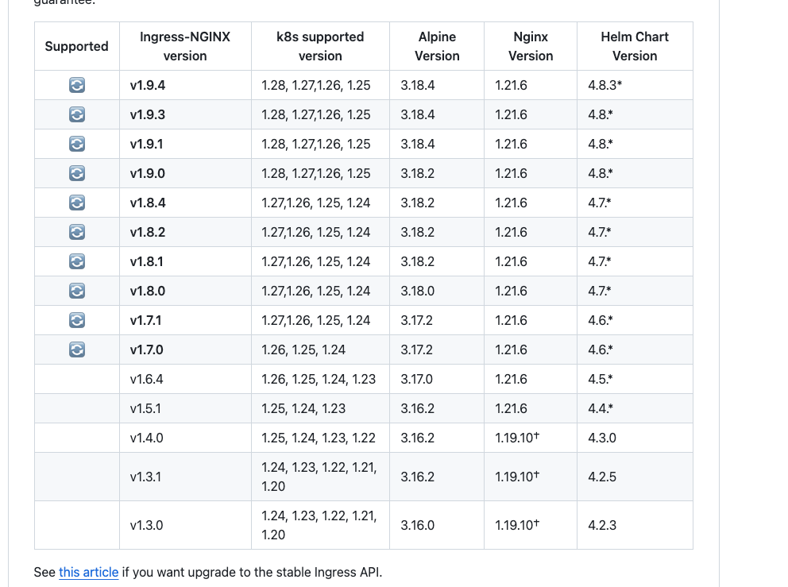

Ingress 是 Kubernetes 中的一种资源类型，用于管理和配置集群中的外部访问。它充当了集群内服务与集群外部的网络之间的桥梁，通过定义路由规则和提供负载均衡服务，使得外部流量能够到达 Kubernetes 集群内的服务。

**ingress的特点：**

1.  路由规则：Ingress 允许你定义外部流量如何到达集群内的服务。通过规定主机名（域名）和路径，你可以将不同的请求路由到不同的服务。这使得你可以在同一个 IP 地址下托管多个服务，并通过不同的路径或域名进行区分。
2.  负载均衡：Ingress 控制器通常会实现负载均衡，将外部流量分发到后端服务的多个副本上。这有助于提高服务的可用性和性能。
3.  TLS/SSL 终端：Ingress 允许你配置 TLS/SSL 终端，以实现通过 HTTPS 加密的安全通信。你可以为每个 Ingress 规则配置不同的 TLS 证书，确保流量在传输过程中是加密的。
4.  自动发现和配置：Ingress 控制器通常会自动发现 Ingress 资源，并相应地配置底层负载均衡器或代理。这简化了配置管理，使得添加、更新或删除路由规则变得更加方便。
5.  灵活性和扩展性：Ingress 的设计使得你可以选择不同的 Ingress 控制器，以适应不同的需求。例如，你可以选择使用 Nginx Ingress Controller、Traefik、HAProxy Ingress 等。这种模块化和可插拔的设计使得 Ingress 可以根据实际需求进行扩展和定制。

这里我们部署Ingress-nginx

官网版本支持图：



在`Kubernetes`中使用`Kubernetes`作为`Ingress Controller`时，可以通过创建TLS秘钥和证书并将它们作为`Secret`资源加载到`Kubernetes`集群中来配置SSL证书。

以下是一个简单的步骤和示例代码，用于创建TLS Secret资源。

首先，你需要有一个私钥和证书文件。私钥文件通常是.key文件，而证书文件可以是.crt或.pem文件。

创建一个Kubernetes Secret资源，将你的TLS秘钥和证书作为数据部分。

假设你的私钥文件名为`tls.key`，证书文件名为`tls.crt`，可以使用以下命令创建`Secret`：

```bash
# https://kubernetes.github.io/ingress-nginx/user-guide/tls/
KEY_FILE=tls.key && \
CERT_FILE=tls.crt && \
CERT_NAME=example-tls-secret && \
openssl req -x509 -nodes -days 3650 -newkey rsa:2048 -keyout ${KEY_FILE} -out ${CERT_FILE} -config openssl.cnf && \
openssl x509 -in ${CERT_FILE} -text -noout &&
kubectl create secret tls ${CERT_NAME} --key ${KEY_FILE} --cert ${CERT_FILE} -n kube-example
```

接下来，在你的Ingress资源中引用这个Secret：

```bash
apiVersion: networking.k8s.io/v1
kind: Ingress
metadata:
  name: example-ingress
  annotations:
    nginx.ingress.kubernetes.io/ssl-redirect: "true"
    nginx.ingress.kubernetes.io/force-ssl-redirect: "true"
spec:
  tls:

- hosts:
  - example.com
    secretName: example-tls-secret
  rules:
- host: example.com
    http:
      paths:
  - path: /
        pathType: Prefix
        backend:
          service:
            name: my-service
            port:
              number: 80
```

在这个Ingress资源定义中，tls部分指定了使用example-tls-secret这个Secret来进行SSL/TLS传输加密，并且通过注解来强制使用HTTPS。
确保替换`tls.key`、`tls.crt`、`example-ingress`、`example.com`、`my-service`和端口号为你自己的实际值。